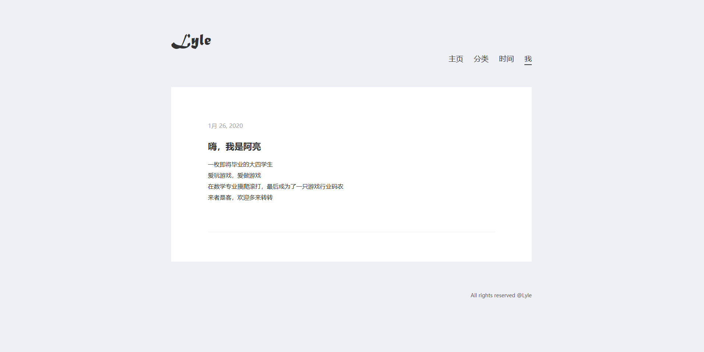

2020有个怪混账的开头。冠状病毒，科比坠机。
这是我第一次过年没回老家。我是喜欢独处的性子，这次算是得偿所愿，一个人霸占整个楼层了。于是尽情声音外放，把拆快递的大箱小箱随意丢在地上，把宿舍当成私人房间来造作。
这难得的几天清闲时间，我倒是过的快活。每天睡到自然醒，醒了玩会dq11s，玩累了就去学点五花八门的技术，学累了又可以上床睡上一觉。
在这猪一般的生活间隙，我捣鼓出了这个个人主页。

之所以没选择五花八门的博客网站，而是决定自己搭建一个，一方面是觉得，学习如何搭建的过程本身就足够有趣，另一方面则是希望拥有一片充分隐秘自由的空间。根本不会有多少人知道这的存在，这样的念头让我觉得安心。
各位此刻既然能在这读我的文字，那就是我的贵宾了。

---
闲话少说，以目前的初步构思，以后这里的文章会被分为三大类：

**游戏   技术   杂谈**

我是个重度游戏迷，尤其喜欢小型独立游戏。时至今日，游戏打了很多了，不乏打完后很想说点什么的时刻，但总是由于忙或懒作罢。时间久了再回顾，那些曾经喜欢或不喜欢的理由都像隔了层雾似的迷迷蒙蒙的。因此还是希望自己以后能勤动动手，写下刚玩完一个游戏时的或感动或恼怒的情绪。

而作为一个初生牛犊程序员，我打算将一些技术进步和心得也记录下来。我应该会时不时研究一些不太有用但还蛮有意思的知识（比如怎么搭个人主页之类的）。但愿我不要懒！

此外，不能分到 ***游戏，技术*** 的文章就统统丢到 ***杂谈*** 这个大垃圾桶里好了。

我还没想好要不要添加评论功能，我担心评论会破坏这种自作多情的隐秘感。但没有互动的话，一个人久了大概确实会感觉枯燥。再让我想想。

---
今天终于传来消息，因为疫情的原因，GGJ官方同意中国站改为线上举办GameJam。
所以接下来两天打算学一些unity2d相关的知识。有时间再给宿舍大扫除一下，衣柜和桌面都乱成一团了。
2020有个注定让人难忘的糟糕开始。
但对我来说，2020是生活从学业转向事业的一年。
从爱玩游戏，到想做游戏，到真正开始做游戏。对我来说，选择走这条道路并不像看起来那么轻松自然。所幸，我现在依然确信我在做自己喜欢的事。
希望新的一年能多写点文字。
我写东西的速度还真是该死的慢。

***新年快乐！***